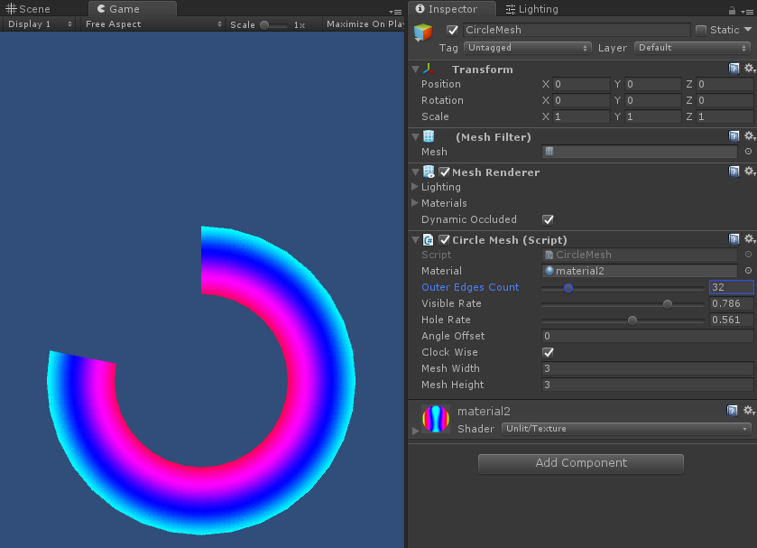

# Circle Graphic

Draw circle with `CanvasRenderer(uGUI)` or `MeshRenderer`.

## Feature

- Lower Overdraw.
- No alpha texture required.

## Requirement

- Unity 2017.4.1f1 or later
- Scripting Runtime Version .NET 4.x Equivalent or later

## Getting Started

### uGUI

- Open `Scenes/CricleGraphicSample` scene and run it.
- Select `CircleGraphic` object under `CircleGraphicCanvas`.
- Tweak `CircleGraphic` component's parameters (`OuterEdgesCount`, `VisibleRate`, `HoleRate`, `Origin` and `ClockWise`).

### Mesh

- Open `Scenes/CircleMeshSample` scene and run it.
- Select `CircleMesh` object.
- Tweak `CircleMesh` component's parameters (`OuterEdgesCount`, `VisibleRate`, `HoleRate`, `AngleOffset`, `ClockWise`, `MeshWidth` and `MesthHeight`).
